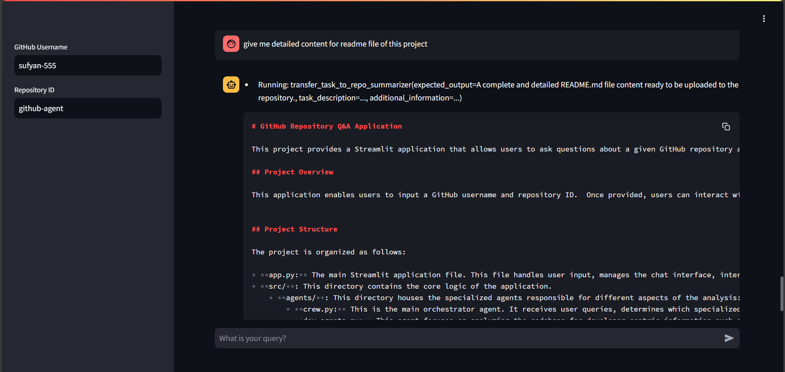

Note this README file was genrated using this application.
----------------

# GitHub Repository Q&A Application

This project provides a Streamlit application that allows users to ask questions about a given GitHub repository and receive answers based on the analysis of its code, documentation, and structure.  It uses a multi-agent system to process the user's queries and provide comprehensive and informative responses.

## Project Overview

This application enables users to input a GitHub username and repository ID.  Once provided, users can interact with the application through a chat interface, where users can ask questions about the repository's code, implementation, and other details.  The application uses a series of specialized agents to analyze the repository's contents and answer user queries in a natural language format.  Instead of automatically generating a comprehensive summary, the application focuses on providing on-demand answers to specific questions, offering a more flexible and interactive way to explore the repository's information.

## Project Structure

The project is organized as follows:

* **app.py:** The main Streamlit application file.  This file handles user input, interacts with the agents, and displays the results.
* **src/**: This directory contains the core logic of the application.
    * **agents/**:  This directory contains different agents responsible for specific tasks:
        * **crew.py:** This agent is the main orchestrator, coordinating the other agents and handling the overall summarization process.  It receives the user's query, determines which specialized agents are needed, and combines their outputs into a cohesive response.
        * **dev_agents.py:** This agent focuses on analyzing the codebase for developer-centric information, such as code style, dependencies, and potential issues.  It can provide insights into the development process and technologies used.
        * **llms.py:**  This agent interacts with large language models (LLMs) to generate natural language summaries and explanations. It can be used to translate technical details into user-friendly language or to answer complex questions about the codebase.
        * **repo_agents.py:** This agent is responsible for interacting with the GitHub API to retrieve information about the repository, such as its description, contributors, and commit history.  It provides context for the other agents.
    * **static/**: This directory contains static resources and data:
        * **repo_static.py:**  Handles updating and storing repository details (e.g., fetching README content).
    * **tools/**: This directory contains utility functions and tools.
        * **repo_tools.py:** This module contains tools for interacting with the repository's files and directories.  It provides functions for parsing, analyzing, and extracting relevant information.
        * **utils/**: This subdirectory contains general-purpose utility functions used throughout the project.
            * **repo.py:** This module contains functions specifically designed for working with GitHub repositories.

* **.gitignore:**  Standard Git ignore file.
* **.python-version:** Specifies the Python version.
* **pyproject.toml:** Project configuration file using Poetry.
* **uv.lock:** File used by `poetry` to manage virtual environments.

## Getting Started

1. **Clone the repository:**  Clone this repository to your local machine.
2. **Install dependencies:** Use `uv` to install the necessary Python packages.
3. **Add your API:** Create `.env` file in root location and set `api=<your google-generative-api>`
3. **Run the application:**  Execute `streamlit run app.py`.
4. **Enter repository details:** In the Streamlit application, enter the GitHub username and repository ID.

## Usage

The application presents a chat interface. Users can ask questions about the repository, and the application will use the gathered information to provide a relevant response.

## Future Improvements

* Add more robust error handling.
* Expand the capabilities of the agents to handle a wider range of repository types and structures.
* Improve the user interface for better usability.
* Add unit tests for improved code quality and maintainability.
